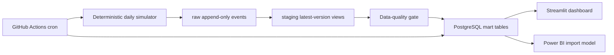

# Automated FinTech KPI Reporting Pipeline

Reproducible, synthetic Hong Kong unsecured-loan data pipeline for portfolio,
credit-funnel, collections, campaign and vintage reporting.

The project is intentionally small enough to explain in an interview, but it
contains the pieces that make a daily batch realistic: append-only events,
versioned corrections, late-arriving payments, idempotent loads, PostgreSQL
marts, data-quality gates, a live Streamlit dashboard and a Power BI model.

## What is simulated

- Anonymous customers, income bands, regions, acquisition channels and internal risk grades.
- HKD unsecured instalment-loan applications, decisions, acceptance and disbursement.
- Amortisation schedules, on-time/partial/late/missed payments and DPD 1+/7+/30+/90+.
- Campaign touches and last-touch attribution.
- Late arrivals, corrections, duplicate events and quarantined invalid records.

No real personal data is used. Income calibration is based on Hong Kong Census
and Statistics Department distributions; HKMA credit-card delinquency data is
used only as an external reasonableness reference, not as a personal-loan
default estimate.

## Architecture



Schemas are `raw`, `staging`, `mart` and `audit`. Events use stable IDs and
versions, so rerunning the same report date is safe.

## Quick start

Use Python 3.12 and a dedicated PostgreSQL 14+ database. The application does
not create a database or print credentials.

```powershell
python -m venv .venv
.venv\Scripts\Activate.ps1
pip install -e ".[dev]"
$env:PIPELINE_DATABASE_URL = "postgresql://..."
python -m fintech_pipeline init-db
python -m fintech_pipeline bootstrap --start 2025-01-01 --end 2026-08-18
python -m fintech_pipeline run --date 2026-08-19
python -m fintech_pipeline export --date 2026-08-19
streamlit run dashboard/app.py
```

For a Unix shell, use `export PIPELINE_DATABASE_URL=...` instead.

Dashboard deployments should use a separate account in
`READ_ONLY_DATABASE_URL`. Grant it access only to selected `mart` views.

## CLI

```text
python -m fintech_pipeline init-db
python -m fintech_pipeline bootstrap --start YYYY-MM-DD --end YYYY-MM-DD
python -m fintech_pipeline run --date YYYY-MM-DD
python -m fintech_pipeline validate --date YYYY-MM-DD
python -m fintech_pipeline export --date YYYY-MM-DD
```

`run` is transactional and protected by a PostgreSQL advisory lock. It loads a
single deterministic batch, records rejected rows, runs quality checks, then
refreshes affected marts. A failed hard check rolls the mart publication back.

## Reporting views

The Streamlit app and Power BI model use the same marts:

1. Executive KPI overview and data freshness.
2. Application → approval → acceptance → disbursement funnel.
3. Portfolio balance, collections and DPD trends.
4. Origination vintage × months-on-book.
5. Channel/campaign performance and pipeline quality.

Power BI files and refresh notes belong under `powerbi/`. Power BI credentials
are entered locally and are never committed.

## Reproducibility and limitations

- Synthetic values are realistic-shaped, not population estimates.
- The project does not make lending, credit-policy or regulatory claims.
- Full generated raw data is not committed; the generator and small samples are.
- The live Streamlit page contains aggregate synthetic data only.
- GitHub Actions runs the PostgreSQL pipeline; it does not refresh Power BI.

## Sources

- [C&SD Quarterly Report on the General Household Survey, 2026 Q1](https://www.censtatd.gov.hk/wbr/B1050001/B10500012026QQ01/att/en/B10500012026QQ01.pdf)
- [C&SD Quarterly Report on the General Household Survey, 2025 Q4](https://www.censtatd.gov.hk/wbr/B1050001/B10500012025QQ04/att/en/B10500012025QQ04.pdf)
- [HKMA credit-card lending survey API documentation](https://apidocs.hkma.gov.hk/documentation/market-data-and-statistics/monthly-statistical-bulletin/banking/credit-card-lending-survey/)

