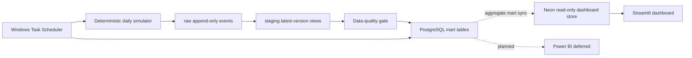

# Automated FinTech KPI Reporting Pipeline

[](https://github.com/BestYlay/automated-fintech-kpi-pipeline/actions/workflows/ci.yml)

[Dashboard](https://automated-fintech-kpi-pipeline-b7m5mnizetmsfkudvcfb8q.streamlit.app/) ·
[Measured verification and metric limitations](docs/release-verification.md)

Reproducible, synthetic Hong Kong unsecured-loan data pipeline for portfolio,
credit-funnel, collections, campaign and vintage reporting.

The project is intentionally small enough to explain in an interview, but it
contains the pieces that make a daily batch realistic: append-only events,
versioned corrections, late-arriving payments, idempotent loads, PostgreSQL
marts, data-quality gates and a Streamlit dashboard. Power BI authoring is paused;
no completed PBIX is included in this release.

## What is simulated

- Anonymous customers, income bands, regions, acquisition channels and internal risk grades.
- HKD unsecured instalment-loan applications, decisions, acceptance and disbursement.
- Amortisation schedules, on-time/partial/late/missed payments and DPD 1+/7+/30+/90+.
- Campaign touches and last-touch attribution.
- Late arrivals, corrections, duplicate events and quarantined invalid records.

No real personal data is used. Income calibration is based on Hong Kong Census
and Statistics Department distributions; HKMA credit-card delinquency data is
used only as an external reasonableness reference, not as a personal-loan
default estimate.

## Architecture



Schemas are `raw`, `staging`, `mart` and `audit`. Events use stable IDs and
versions, so rerunning the same report date is safe.

## Quick start

Use Python 3.12 and a dedicated PostgreSQL 14+ database. The application does
not create a database or print credentials.

```powershell
python -m venv .venv
.venv\Scripts\Activate.ps1
pip install -e ".[dev]"
$env:PIPELINE_DATABASE_URL = "postgresql://..."  # local PostgreSQL
python -m fintech_pipeline init-db
python -m fintech_pipeline bootstrap --start 2026-01-01 --end 2026-08-18 --workers 2
python -m fintech_pipeline daily --through 2026-08-24 --workers 2 --lookback-days 45
streamlit run dashboard/app.py
```

For a Unix shell, use `export PIPELINE_DATABASE_URL=...` instead.

Dashboard deployments use a separate `READ_ONLY_DATABASE_URL` account on the
Neon aggregate store. The local writer never sends raw, staging or audit data
to Neon. `MART_PUBLISH_DATABASE_URL` is a direct Neon connection restricted to
the five mart tables.

## CLI

```text
python -m fintech_pipeline init-db
python -m fintech_pipeline bootstrap --start YYYY-MM-DD --end YYYY-MM-DD --workers 2
python -m fintech_pipeline run --date YYYY-MM-DD
python -m fintech_pipeline validate --date YYYY-MM-DD
python -m fintech_pipeline export --date YYYY-MM-DD
python -m fintech_pipeline daily --through YYYY-MM-DD --workers 2 --lookback-days 45 --publish
python -m fintech_pipeline publish-marts --start YYYY-MM-DD --end YYYY-MM-DD
```

`run` is transactional and protected by PostgreSQL advisory locks. It loads a
single deterministic batch, records rejected rows, runs quality checks, then
refreshes affected marts. A failed hard check rolls the mart publication back.
`bootstrap` keeps raw generation sequential because customer and repayment
state crosses dates; after raw loading, it rebuilds date-scoped marts with the
requested number of PostgreSQL workers and records separate raw/mart ETAs.
`daily` catches up missing dates in order, refreshes the rolling correction
window with the requested workers, exports the latest snapshot and optionally
publishes only aggregate marts to Neon. The Windows installer and runner are
under `scripts/install_local_schedule.ps1` and `scripts/run_daily_local.ps1`.

To install the local 01:30 Hong Kong schedule, run PowerShell while logged in
as the Windows user that owns the local database:

```powershell
Set-ExecutionPolicy -Scope Process Bypass
.\scripts\install_local_schedule.ps1
```

The installer prompts for the local writer URL and the Neon direct
`mart_publisher` URL, then stores both with Windows-user DPAPI protection under
`%LOCALAPPDATA%\FinTechPipeline`. The task runs only while this user is logged
in, catches up missed dates, retries up to three times and never starts a
second copy while one is active. Remove it with
`scripts\uninstall_local_schedule.ps1`; add `-RemoveCredentials` only when the
local encrypted credentials should also be removed.

The Neon roles and grants are documented in
`docs/neon_mart_publisher.sql`. Only the five aggregate mart tables are
published; raw events, staging views and audit tables stay local.

After the local history is complete, perform the one-time aggregate snapshot
with:

```powershell
.\scripts\publish_marts_local.ps1 -Start 2026-01-01 -End 2026-08-24
```

## Reporting views

The Streamlit app uses these reporting marts (Power BI is deferred):

1. Executive KPI overview and data freshness.
2. Application → approval → acceptance funnel, plus separate daily disbursement flows.
3. Portfolio balance, collections and DPD trends.
4. Origination vintage × months-on-book.
5. Channel/campaign performance and pipeline quality.

Power BI files and refresh notes belong under `powerbi/`. Power BI credentials
are entered locally and are never committed.

## Reproducibility and limitations

- Synthetic values are realistic-shaped, not population estimates.
- [Metric definitions](docs/metric_dictionary.md) distinguish daily flows, snapshots,
  loan-level delinquency and calendar-month vintage cohorts. The September 2026
  business correction is documented in [release verification](docs/release-verification.md).
- The project does not make lending, credit-policy or regulatory claims.
- Full generated raw data is not committed; the generator and small samples are.
- The live Streamlit page contains aggregate synthetic data only.
- Windows Task Scheduler runs the local PostgreSQL pipeline. GitHub Actions is
  retained for CI only; it does not run the production daily batch.

## Sources

- [C&SD Quarterly Report on the General Household Survey, 2026 Q1](https://www.censtatd.gov.hk/wbr/B1050001/B10500012026QQ01/att/en/B10500012026QQ01.pdf)
- [C&SD Quarterly Report on the General Household Survey, 2025 Q4](https://www.censtatd.gov.hk/wbr/B1050001/B10500012025QQ04/att/en/B10500012025QQ04.pdf)
- [HKMA credit-card lending survey API documentation](https://apidocs.hkma.gov.hk/documentation/market-data-and-statistics/monthly-statistical-bulletin/banking/credit-card-lending-survey/)
